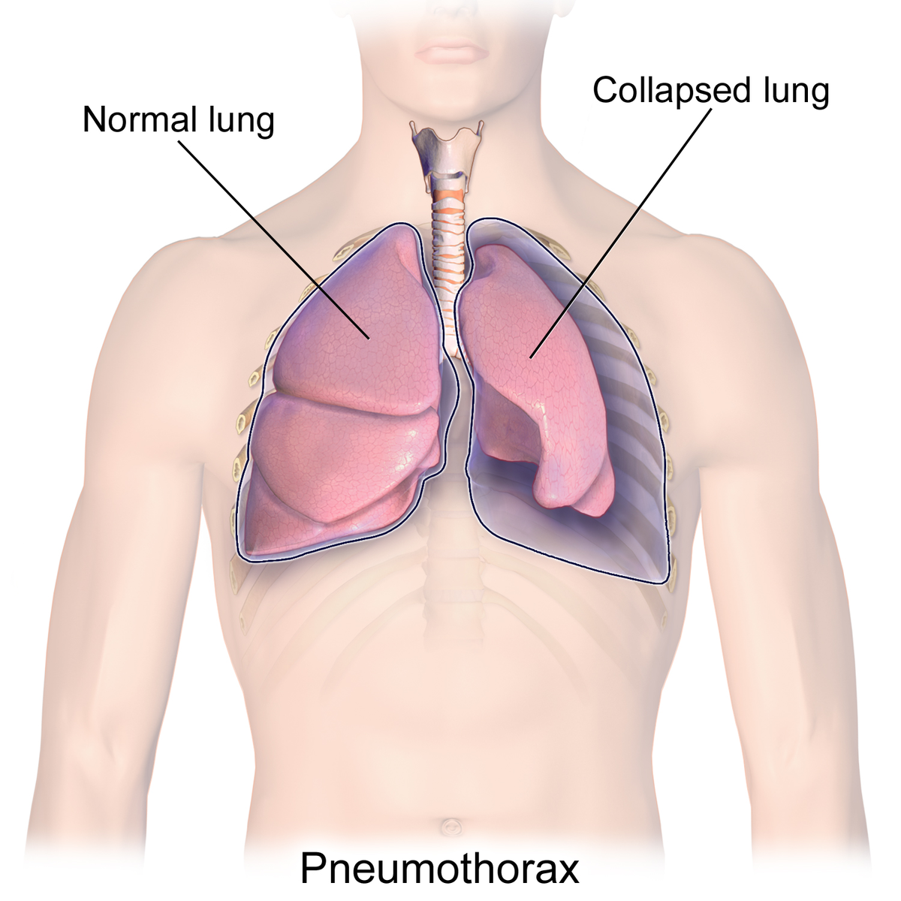
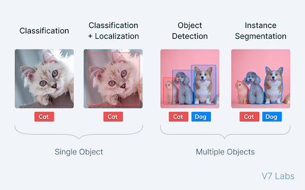
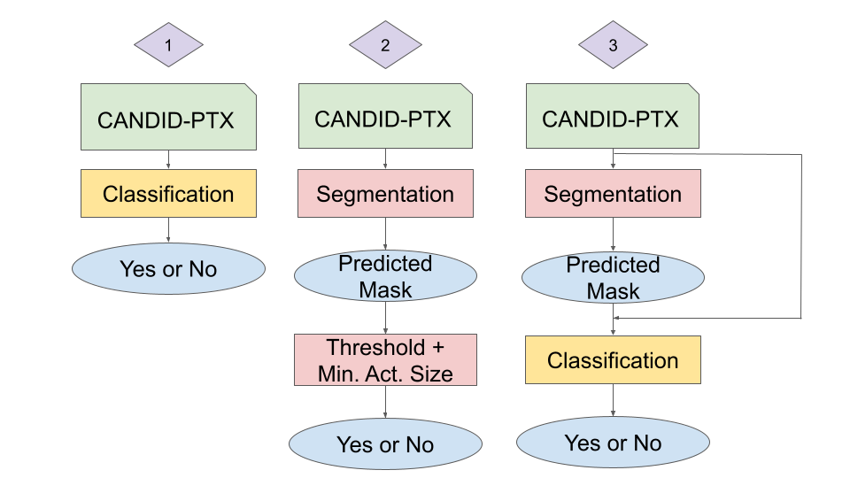
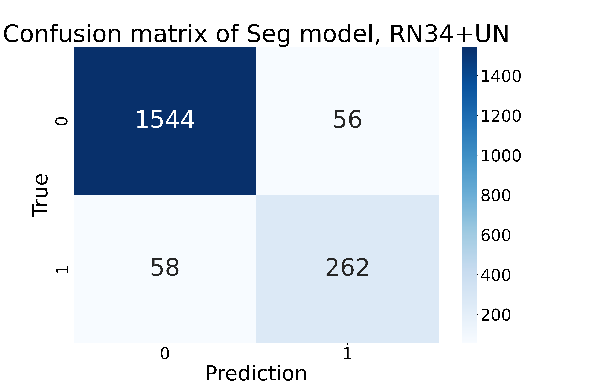
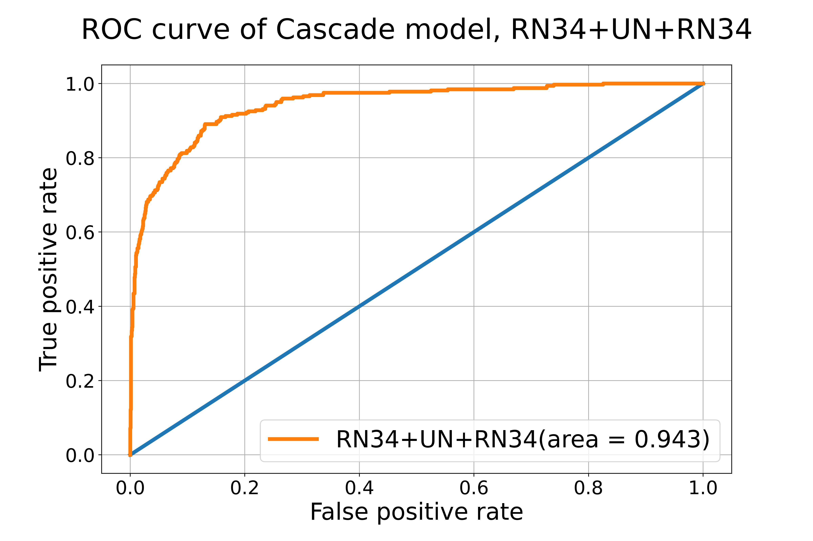
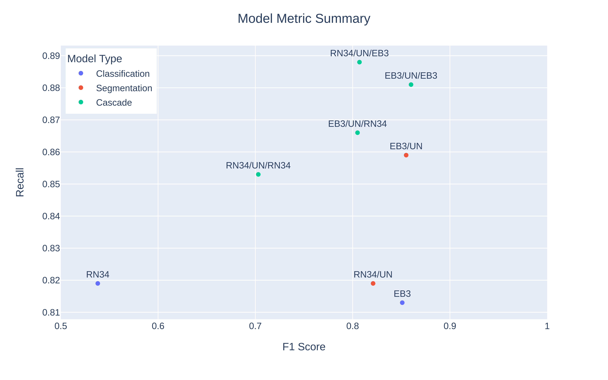

# Introduction
What is pneumothorax? It is also called collapsed lung. It happens when a patient has a puncture/punctures on their lung, causing air to leak out into the space between lung and the chest wall. In this way, patients breathe in less air for each breath. Some of the most common symptoms include sudden chest pain and shortness of breath. Chest X-rays are the most common method for patients to get diagnosis for pneumothorax. However, only very few experts in radiology are able to give the diagnosis, creating very long wait times for patients to get proper treatments. 

<figure>

<figcaption align = "center"><b>Fig 1: Pneumothorax Example. Credit: https://en.wikipedia.org/wiki/Pneumothorax </b></figcaption>
</figure>

To solve this pressing problem, machine learning models like convolutional neural networks (CNNs) have been widely used to help give patients diagnoses based on their chest X-rays. CNNs use a lot of convolutional layers to conduct convolution on images and extract helpful information. It is therefore very popular for image dataset. There are many structures of CNNs, including classification, localization, object detection, and instance segmentation models. The differences between these models are illustrated below:

<figure>

<figcaption align = "center"><b>Fig 2: Different CNN models. Credit: https://www.v7labs.com/blog/image-segmentation-guide </b></figcaption>
</figure>

There has been a lot of previous research testing on the performance of classification and segmentation models on pneumothorax detection. However, very few previous publications look at cascade models, where a classification model is piped after a segmentation model. We are interested in asking: **Do cascade models outperform both classification and segmentation models, given that cascade models should theoretically inherit the benefits of both models?**

The dataset we are using is called "CANDID-PTX". It contains 19,237 unique anonymized patient chest radiographs from New Zealand. All the positive cases have manually labeled pneumothorax segmentations by experienced radiologists. [Here](https://pubs.rsna.org/doi/10.1148/ryai.2021210136) is the link to their publication if you are interested in how researchers curated the dataset.  

# Method
We tested two classification models, two segmentation models, and four cascade models to compare their performance. 
## Classification Models
 - ResNet 34
 - EfficientNet-B3
 
## Segmentation Models
 - ResNet 34 (encoder) + UNet (decoder)
 - EfficientNet-B3 (encoder) + UNet (decoder)

## Cascade Models
 - ResNet 34 (encoder) + UNet (decoder) + ResNet 34 (classification)
 - ResNet 34 (encoder) + UNet (decoder) + EfficientNet-B3 (classification)
 - EfficientNet-B3 (encoder) + UNet (decoder) + ResNet 34 (classification)
 - EfficientNet-B3 (encoder) + UNet (decoder) + EfficientNet-B3 (classification)
 
 Below is a flowchart for the pipeline for each of the three structures that we are comparing: 
 

<figure>

<figcaption align = "center"><b>Fig 3: An illustration of three different model structures. </b></figcaption>
</figure>

As shown above, all models will give a "Yes" or "No" prediction for each of the input chest X-rays. The segmentation model results were transformed into binary with hard thresholds based on [previous publication results](https://pubmed.ncbi.nlm.nih.gov/35224858/). 
 
# Result
After training the segmentation models, we want to see what are some of the correct and wrong predicted masks, and here are our selected results:

<figure>

<figcaption align = "center"><b>Fig 4: Sample Predicted Mask, True Mask, Chest X-Ray, and Overlayed Chest X-Ray.  Demonstration of ResNet 34 (encoder) + UNet (decoder) segmentation model predicted masks with true masks. TP: true positive, FN: false negative, FP: false positive </b></figcaption>
</figure>

In order to visualize the performance of each model on the entire test set with 1,920 chest radiographs, we plotted their confusion matrices, and below is one sample confusion matrix from the ResNet 34 (encoder) + UNet (decoder) segmentation model:

<figure>

<figcaption align = "center"><b>Fig 5: Sample Confusion Matrix </b></figcaption>
</figure>

ROC curves are also common metrics to evaluate models. The closer the ROC-AUC score is to 1, the better the model is at classifying labels correctly. We achieved ROC-AUC scores similar to published results. See one example below:

<figure>

<figcaption align = "center"><b>Fig 6: Sample ROC Curve </b></figcaption>
</figure>

In order to compare all the models fairly, we computed the recall and F1 scores for each model based on their prediction results. Below is the result from all eight of the models we tested:

<figure>

<figcaption align = "center"><b>Fig 7: Overall Model F1 and Recall Performance </b></figcaption>
</figure>

# Conclusion
Based on the F1 and Recall performance, the best model overall is EfficientNet-B3 (encoder) + UNet (decoder) + EfficientNet-B3 (classification), which is a cascade model. Mose of the cascade models tend to cluster at the upper right corner of the Figure 7, meaning that they have the best performance overall. Segmentation models with EfficientNet-B3 as encoders also perform relatively well. The classification models perform the worst in our investigation. 

Based on our investigation, cascade models that pipe segmentation and classification models together have the highest performance and have many real-world benefits, including they produce both classification results and predicted pneumothorax masks for radiologists to review. In addition, they save the trouble of finding a good hard cut-off for segmentation models. We also found that overall, EfficientNet-B3 perform better than ResNet 34 regardless of model structures. 

# References
Feng, Sijing et al. “Curation of the CANDID-PTX Dataset with Free-Text Reports.” Radiology. Artificial intelligence vol. 3,6 e210136. 13 Oct. 2021, doi:10.1148/ryai.2021210136

Feng, Sijing et al. “Automated pneumothorax triaging in chest X-rays in the New Zealand population using deep-learning algorithms.” Journal of medical imaging and radiation oncology vol. 66,8 (2022): 1035-1043. doi:10.1111/1754-9485.13393
